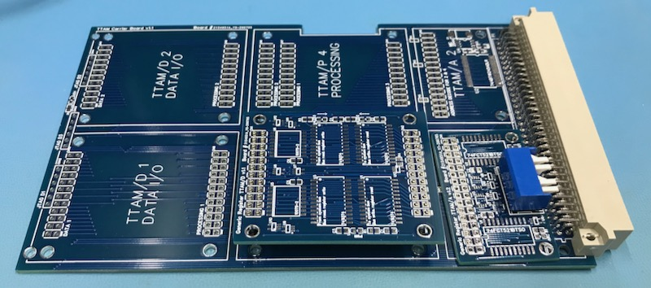
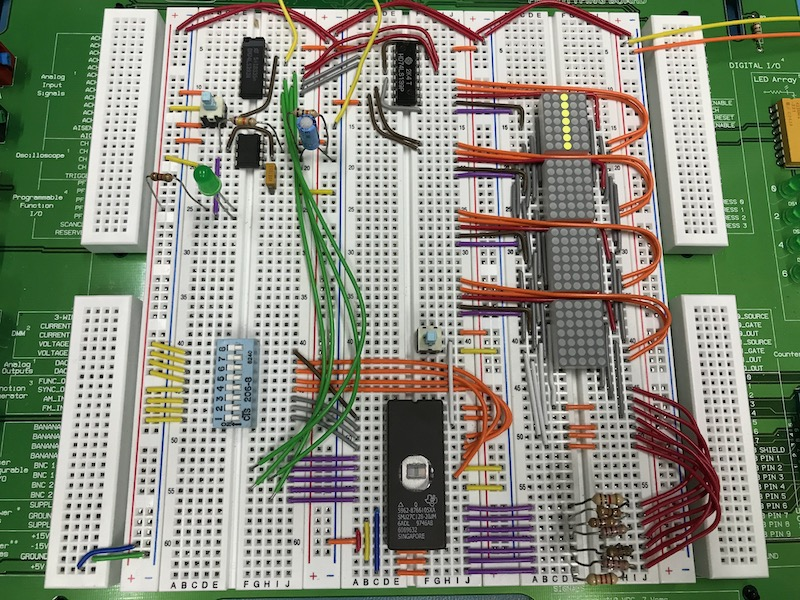
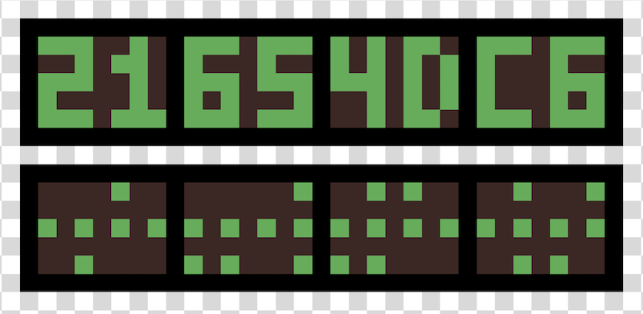

Build Log
=========

2020-07-26

The PCBs have arrived, and look good. Two mounting holes to connect to the front panel are slight off, but that won't prevent me from assembling the first version of the carrier board. Second Digikey order has been placed, and I almost have everything needed to assemble the board.

Good progress has also been made on the bus monitor board design. I've prototyped out the display subsystem using a 74LS393 dual counter (using 5 bits) that drives 6x 74HC139 to select the columns, with a 27C128 EPROM driving the rows. This implements a simple multiplexed display driver, with the high and low 8-bits of the address and data busses being switched as inputs to the EPROM, in sync with the display column selection.

The final design will use a 3x SN74HCT138 demultiplexers. Two switches will controls the render style and controls if the board shows live bus values or stored register values (from two TTAM/D sites on the board).

I can also have two banks programmed in, allowing me to have to different visual representations, one showing hex values of the address and data busses, and a second showing a binary representation.

2020-07-12

PCBs have shipped, Digikey order is placed. While I've been doing more work on the bus monitor, there is enough of an overlap between the carrier board and the monitor board that I want to wait until I've tested the carrier board before finishing up the bus monitor PCB.

I'm also unhappy with the delay system. I am looking at using a DS1124 instead, which is programmable. This, of course, introduces a bootstrapping problem that wasn't present when each module has the delay hard-wired onto the module. So to do this, there would need to be a discovery/configuration phase at startup, where some entity scans all connected function units, configures delays, before the system boots. This would necesitate having some serial EPROM on each module (which would take some board space, but much less board space than the delay subsystem).

This discovery phase has other uses, as it can drive the input to a compiler. This is especially important for TTA architectures, as generating machine code requires detailed knowlege of the available functional units and their addresses.

2020-07-04

Re-worked the power distribution net on the TTAM carrier PCB to handle the fact that some of the ICs that may be mounted on TTAM/D boards can draw up to an amp at 5V. 24 mils should be more than enough.

I'm starting to order more parts, and have a big Digikey order queued up to place next week. With the carrier board ready to get fabbed, next weekend I can spend some time back on the bus monitor.

2020-07-01

Finally got the generic TTAM carrier PCB finished. It took much longer than I expected because of the number of times I had to fiddle around with traces each time I would move things around. Parametric EDA sure is looking appealing right now. I’ll be basing the bus monitor and bus control boards off this board, with positions 1 and 2 removed, and the TTAM/P replaced with a TTAM/D module socket.

I originally had the JTAG lines all connected together, but that only works when all the TTAM/D sockets are populated with modules that support JTAG. I could use some jumpers or DIP switches to allow them to be enabled/disabled, but for this revision, I broke out the JTAG lines from each module to a seperate connector.

Looks like it's time to order some PCBs to do a final physical check. The last batch of boards was held by DHL for three weeks due to shipping issues (grrr), hopefully this one will be a bit faster getting here.

I received the 3U VME chassis I ordered a few days ago, and it looks like it's designed for 260 mm deep cards, rather than the 160 mm deep card that I've been designing. It will still work, though, but I won't be able to install the the front panels on the carrier boards.

2020-06-21

Having a bus monitor is important for debugging and single-step programming. I'd like to have the bus monitor serve two purposes: To show the status of the bus, and to show the value of two registers. This way the same card can be used as a simple output device. As such, the bus monitor card needs to support two optional GRAMs+GRDMs.

Switching between the live address and data busses requires a switch, ideally something like a '257, but unfortunately, the only ones I have on-hand are HC, and thus won't work with the TTL voltages that I'm using.

Displaying the bus values could be done using LED bar graphs, 16 LEDs for each bit of the address bus and 16 LEDs for each bit for the data bus. However, I'd like to show them as hex values, since that simplifies programming. While this can be accomplished using a 7-segment display and some logic, I'm going to use a small EPROM as a look-up table and some LED matrix displays instead. This way I can show either binary or hex. These are now ordered, along with some right-angle DIP sockets (which are surprisingly hard to find and expensive).

Since the bus monitor board is based on the TTAM Carrier, I've been working on that board first. It's a little tricky to route with only two layers, but I'll be able to make it work.

2020-06-13

The first functional unit, a single register, is done. The delay logic to handle asynchronous operation takes more board space than I would have liked. The delay IC I chose is one I have on hand, selecting a different one that has a different configuration of delays may allow me to reduce the number of delay ICs from two to one, which would save some space. I could also move this onto the carrier, but that only makes sense if the delay can be made configurable. 

Using a different register IC would also allow me to reduce the number of ICs, but then I can’t use boundary scan to test things, which is an area of system design that I would like to explore in this project.

Perhaps I need to abandon having boundary scan on each register functional unit, and instead build a boundary scan module? This also would deal with the problem of not being able to drive control lines in the current design.

2020-06-07

The address board is done, this decodes the address bus and handles the control signals to indicate when a functional unit should read from the bus or write to the bus. Language here is a little confusing, since reading the contents of a register is a write to the bus, and writing to a register is a read from the bus, so signal names are “wrong” depending on from what perspective you’re looking at.

Not 100% happy with so many pins being required for the address module. I would have preferred to stick with 24 pins, not 32.

2020-06-06

Start of project. Figured out basic bus structure and control lines. Goal is to support both a synchronous clock and fully asynchronous operation, with each functional unit signalling when it is finished processing. Asynchronous operation requires additional logic to handle delays in each functional unit, however. We'll see how much of a problem this will be.

Goal is to have modular "plug-ins" that attach to a carrier board. That way I can have one standard VME-style board and pick and choose which functional units are installed. Ideally, the carrier board would be completely passive, but in order to avoid long traces tee'd off of the backplane, I'll likely need a bus transceiver to drive the board (and the bus).